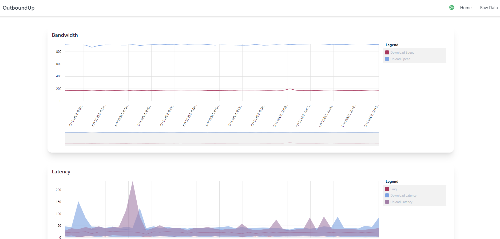

# OutboundUp

OuboundUp is a real-time, outbound internet connection monitor and speed tester. It is fully containerized, and can be run with or without full Sqlite database persistence.

- Ookla Speed Test
- Sqlite persistence layer
- Angular front-end
- .net core 6 backend
- Quart.net for job scheduling

## Docker

OutboundUp is designed to be ran out of a container:

```sh
docker run -d -p 8080:80 outbound-up
```

This will start the container in the background, and it will immediately being running speed tests. The UI can be viewed by visiting `localhost:8080`.


